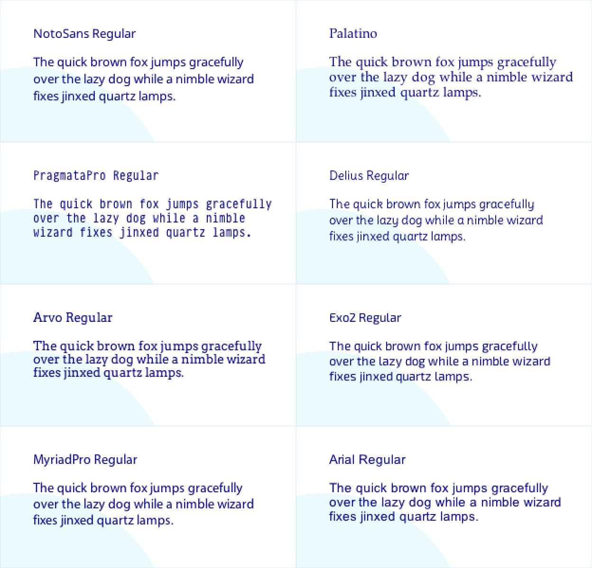

MiniType is a tiny, fast bitmap font format for embedded devices.

Pixel fonts have been the faithful workhorse of microcontrollers for decades: simple, efficient, and charmingly blocky. But sometimes you want text that looks a little smoother—without needing a desktop-class GPU. MiniType is here to bridge that gap.

What makes MiniType especially exciting is that it opens the door for the vast world of existing fonts—serifs, sans, handwritten, decorative—to actually run on microcontrollers. Pixel fonts will always be great, but some things they simply cannot capture: thin serifs, cursive strokes, playful handwriting styles. MiniType lets you bring those subtleties to even the humblest MCU displays.

By pre-blending antialiased glyphs, compressing the data, and keeping decoding O(1), MiniType lets you get crisp, modern-looking text while still fitting into the tight shoes of MCU hardware. It won’t make your OLED suddenly 4K, but it can make “Hello, world” look less like “HELLO, WORLD.” 😉

**Key benefits:**

- 💾 _Pretty compact_ — A full ASCII font at 13px occupies just about 4kb
- 🚀 _O(1) lookup, even on sleepy MCUs_ — Direct indexing ensures consistent, fast glyph access even on slow MCUs
- ✨ _Softer, antialiased edges_ — Precomputed antialiasing makes text look polished and easy on the eyes
- 🔧 _Developer-friendly format_ — Simple to parse, straightforward to generate, with no runtime surprises
- _Effortless conversion_ — Use the provided CLI tool to convert any OTF/TTF font into MiniType

## Demos


MiniType offers a smoother option when readability matters. Think of it as pixel fonts with a nice haircut: same efficiency, a bit more polish.

Here are some common and uncommon styles and how they translate with MiniType. You can download some of them from [samples](./samples/). And produce rest with one terminal command.



## How to use?

1. Generate your bitmap font

```sh
cargo install minitype
minitype --ttf ./SF-Compact-Rounded-Medium.otf --size 13 -o ./assets/sf_13.mtf
```

2. Embed in your project

```rs
use minitype::{MiniTypeFont, MiniTextStyle};
use embedded_rgba::*;

const SF_13: MiniTypeFont = MiniTypeFont::raw(include_bytes!("./assets/sf_13.mtf"));
let text_style = MiniTextStyle::new(&SF_13, Rgb565::WHITE);

Text::with_alignment("Hello, world!", Point::new(10, 10), text_style, Alignment::Left)
  .draw(&mut canvas.alpha())
  .unwrap();
```
