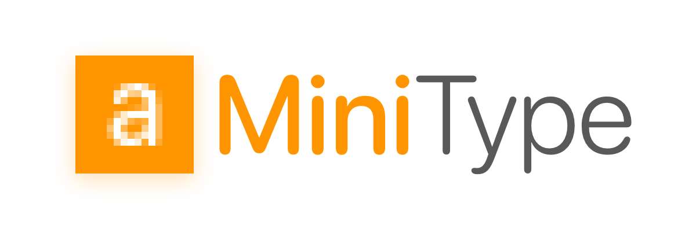

# MiniType

MiniType is a tiny, fast bitmap font format built for embedded devices, and for anyone who loves squeezing performance from minimal hardware 💾🚀

In most microcontroller projects, pixel fonts are the norm — they're simple and efficient, but often look crude and highlight the limited nature of the device’s display. MiniType offers a better way: it keeps the efficiency and small size of pixel fonts while delivering smoother, more modern text rendering with alpha blending and support for multiple sizes.

Pixel fonts are lightweight and fast, but their blocky appearance can make text hard to read and limit the overall user experience. MiniType improves on this by providing pre-blended alpha edges and O(1) glyph lookup, so you get crisp, readable text without sacrificing performance or memory. It’s a perfect balance between simplicity and quality, designed specifically for the constraints of embedded systems.

Why does this matter? On microcontrollers and tiny screens, every byte and every cycle counts. O(1) lookup means you can fetch a glyph instantly—no scanning tables or decompressing blobs. Alpha blending (✨) is precomputed, so even on low-res, tiny displays, your text looks crisp—not jaggy or blocky. And because the fonts are so small, you can actually afford to store multiple sizes or faces on devices with only a few hundred KB of flash.

**Key benefits:**

- 💾 _Fits in KBs, not MBs_ — Store full ASCII/Unicode fonts in a fraction of the space TTF/OTF needs.
- 🚀 _O(1) glyph lookup_ — Glyphs are indexed directly; fetching and rendering is always instant, even on slow MCUs.
- ✨ _Alpha blended edges_ — Precomputed antialiasing means text looks smooth, even on 1-bit or low-color screens.
- 🔧 _Dev-friendly format_ — Easy to parse, dead simple to generate, and no runtime surprises.
- _Fast rendering_ — Typically microseconds per glyph, so your UI stays snappy.
- _Easy conversion_ — Use standard tools to turn any OTF/TTF into MiniType—no proprietary lock-in.

## Screenshots & Demos

- TTF vs. MiniType rendering on a small display — see how much smaller your fonts can be, without sacrificing readability.
- Alpha blending demo — tiny glyphs with smooth edges, no jaggies, even on pixel-dense screens.
- Flash usage chart — see exactly how much space you save; perfect for those tight flash partitions.
- Multi-size font showcase — render the same font at 8px, 12px, 16px with no extra RAM or CPU cost.
- Streaming decode animation — watch glyphs render as they arrive, no buffering or waiting.

Imagine your project running faster, looking better, and fitting more features because your fonts are finally the right size. Try out the demos above, or drop MiniType into your next embedded project and see the difference! 🚀✨

  made with ❤️ by <a href="https://github.com/dempfi">@dempfi</a>

