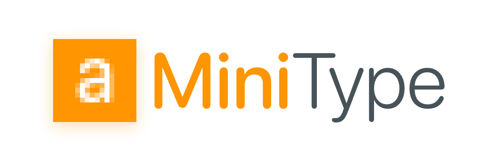

MiniType is a tiny, fast bitmap font format for embedded devices.

Pixel fonts work great on microcontrollers: simple, efficient, and charmingly blocky. But sometimes you want text that looks a little smoother — without needing a desktop-class GPU. MiniType is here to bridge that gap.

With MiniType you can take whatever typeface — serifs, sans, handwritten, decorative — and make them actually run on microcontrollers. Pixel fonts will always be great, but some things they simply cannot capture: thin serifs, cursive strokes, playful handwriting styles. MiniType lets you bring those subtleties to even the humblest MCU displays.

By pre-blending antialiased glyphs using Servo's advanced [WebRenderer](https://github.com/servo/webrender), compressing the data, and keeping decoding O(1), MiniType lets you get crisp, modern-looking text while still fitting into the tight shoes of MCU hardware. It won’t make your OLED suddenly 4K, but it can make “Hello, world” look less like “HELLO, WORLD.” 😉

For alpha compositing, MiniType relies on [embedded_rgba](http://github.com/dempfi/embedded-rgba) that handles alpha and fast buffered rendering.

**Key benefits:**

- 💾 _Pretty compact_ — A full ASCII font at 13px usually occupies less than 4kb with most tyepfaces
- 🚀 _O(1) lookup_ — Direct indexing ensures consistent, fast glyph access even on slow MCUs to run your animations
- ✨ _Softer, antialiased edges_ — Precomputed antialiasing makes text look polished and easy on the eyes
- 🔧 _Developer-friendly format_ — Simple to parse, straightforward to generate, with no runtime surprises
- _Effortless conversion_ — Use the provided CLI tool to convert any OTF/TTF font into MiniType

## Demos

<p align="center">
  
</p>

MiniType offers a smoother option when readability matters. Think of it as pixel fonts with a nice haircut: same efficiency, a bit more polish.

Here are some common and uncommon styles and how they translate with MiniType. You can download some of them from [samples](./samples/). And produce rest with one terminal command.

<p align="center">
  
</p>

## How to use?

1. Generate your bitmap font

```sh
cargo install minitype-cli
minitype --ttf ca./SF-Compact-Rounded-Medium.otf --size 13 -o ./assets/sf_13.mtf
```

2. Embed in your project

```rs
use minitype::{MiniTypeFont, MiniTextStyle};
use embedded_rgba::*;

const SF_13: MiniTypeFont = MiniTypeFont::raw(include_bytes!("./assets/sf_13.mtf"));
let text_style = MiniTextStyle::new(&SF_13, Rgb565::WHITE);

Text::with_alignment("Hello, world!", Point::new(10, 10), text_style, Alignment::Left)
  .draw(&mut canvas.alpha())
  .unwrap();
```
